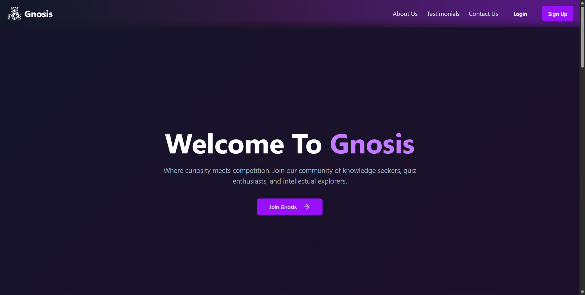
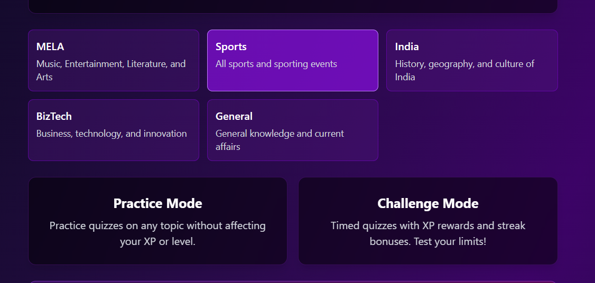
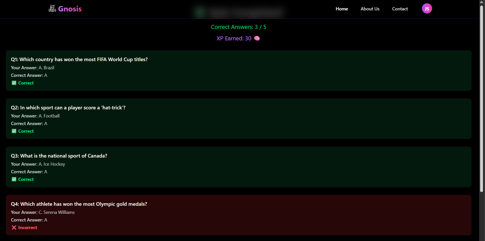

# Gnosis: AI-Powered Quizzing Platform

Gnosis is an intelligent, full-stack quizzing platform built for our university’s quizzing club. It enables users to practice topic-wise quizzes, take AI-generated challenge mode tests, and track their performance through an XP-based gamification system. It is designed for scalability, interactivity, and a seamless quiz experience.

# 1. Project Setup & Demo

### Web
1. Clone the repository:
bash
git clone https://github.com/Divlm10/PlumAssignmentTopic2.git

Install dependencies and start the project:
cd PlumAssignmentTopic2
npm install
npm start

Frontend:
cd client
npm run dev

Backend:
cd server
node index.js

# 2. Problem Understanding

The goal of this project is to build a quiz platform that leverages AI (OpenAI GPT) to generate dynamic quiz questions for users.
Users can choose Practice Mode or Challenge Mode.
Challenge Mode quizzes are timed and reward XP for correct answers.
Practice Mode allows learning without affecting XP.
AI generates MCQs or descriptive questions dynamically based on the selected topic.

Assumptions:
Users have an active internet connection for AI API calls.
Each quiz question has one correct answer.
XP calculation is based on correct answers only.

# 3.AI Prompts & Iterations

Initial Prompt: Generated descriptive questions with short answers.

Issues: Answers were free-text; evaluation logic often marked correct answers wrong.

Refined Prompt:

Generate MCQs with 4 options (A–D)

Return JSON:
  [
  { "question": "...", "options": ["A", "B", "C", "D"], "answer": "A" }
  ]

# 4.Architecture & Code Structure
  /src
 ├─ /components
 │   ├─ ChallengeQuizPage.jsx
 │   ├─ QuizButtons.jsx
 │   └─ QuizResult.jsx
 ├─ /api
 │   └─ userApi.js       // User XP and profile API
 ├─ /controllers
 │   └─ quizController.js
 ├─ App.jsx              // Main routing
 └─ index.js             // Server entry point

State Management: React useState and useEffect for quiz state.

Backend: Node.js + Express handles API calls and sessions.

AI Service: OpenAI GPT generates questions dynamically.

# 5.ScreenShots
<!-- landing page -->
 
---

<!-- topic selection  -->

<!-- Sample Quiz -->

<!-- Evaluation Page -->

# 6.Known Issues / Improvements

Current Limitations:
Challenge quiz requires stable internet for AI calls.
Evaluation logic is MCQ-based; descriptive answers may need better NLP scoring.
No multiplayer or leaderboard features implemented yet.

Potential Improvements:
Store generated questions for repeated attempts.
Add more advanced AI evaluation for free-text descriptive answers.
Implement timed countdown visible on all devices consistently.
Enhance UX with animations and progress indicators.

# 7.Bonus Work

###  XP & Credit System
- Users earn XP for activities like logging in and completing challenges
- Challenge Mode access is gated by a credit system:
  - 7 free credits on signup
  - Recharge via Stripe: ₹10 → 2 credits, ₹99 → 25, ₹199 → 65
  - 1 credit deducted per challenge attempt

###  Admin Tools
- Admin dashboard to upload upcoming events and quizzes
- CRUD operations on event data
- Makes the platform a one-stop portal for the club

###  User Analytics
- Integrated `timeme.js` to track active time spent on quizzes
- Helps measure real engagement and quiz-taking behavior

---

## 💻 Tech Stack

###  Frontend
- React.js
- Tailwind CSS
- Axios
- React Router

###  Backend
- Express.js
- Node.js
- PostgreSQL
- OpenAI API
- Stripe API (for subscription payments)

###  Developer Tools
- VS Code, Postman, Git

---

